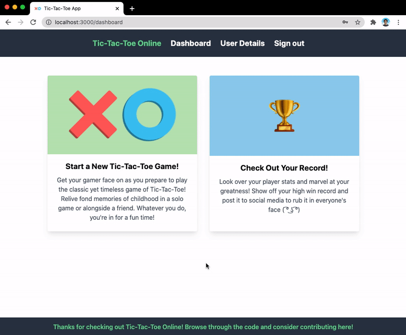

# Tic-Tac-Toe Web App:

A tic-tac-toe web application built using the MERN stack (MongoDB, Express, React, Node.js).

## The MERN Stack:

MongoDB Atlas is used as the cloud database service to store user data and tic-tac-toe game data. Express is used as the server framework for Node.js, a JavaScript runtime environment for servers and applications. React is used as the frontend framwork for the application.

## Project Details:

When ran, users are redirected to a login page where they can either log in or register for a new account. Login functionality is handled by the user API. Upon login, the application displays a dashboard from which users can either start a new game or look at their own user data. Game functionality is handled entirely on the server-side and requests are sent and back and forth between the frontend and backend upon each player move. When a move is made at a particular position it does not get overridden. When the game ends, no more moves are made. Users can start a new game by revisiting the dashboard and starting a new game. User data is updated upon each revisit to the user data page.

## How to Run:

There are package.json files in both the frontend and backend folder. Install the relevant dependencies by running: `npm install` in both directories.

Create a .env file in the backend directory with an `ATLAS_URI` variable with the appropriate MongoDB Atlas connection string.

Open the frontend directory in a terminal and run `npm start`. Also open the backend directory and run `nodemon server`. After this setup, you should be able to use the application's full functionality.

## Screenshots

### Login Page

### Game Win to User Details

### Game Loss to User Details

